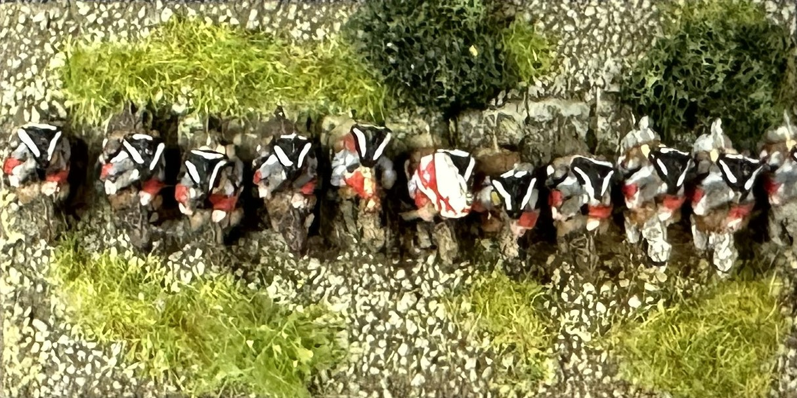
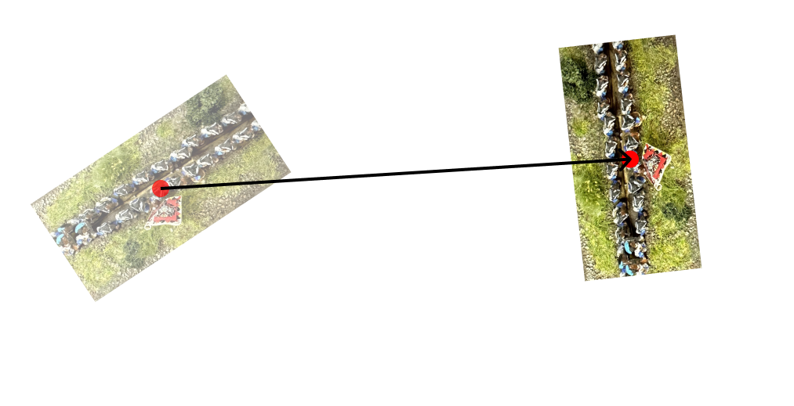
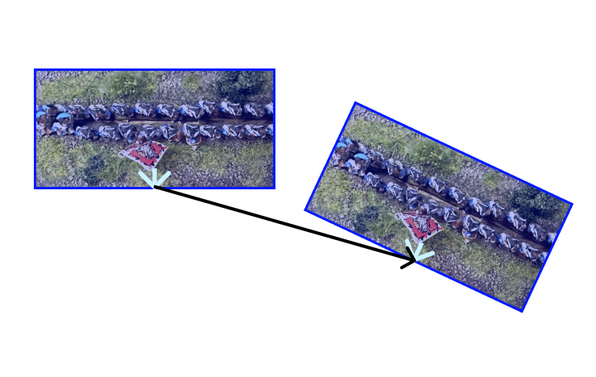
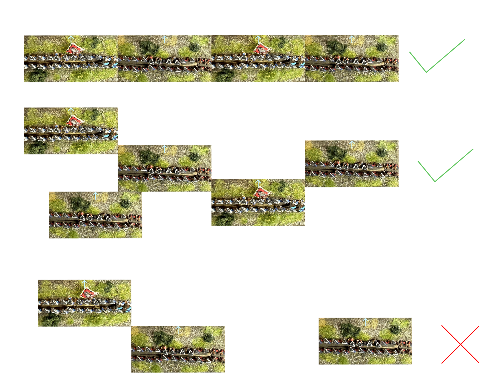
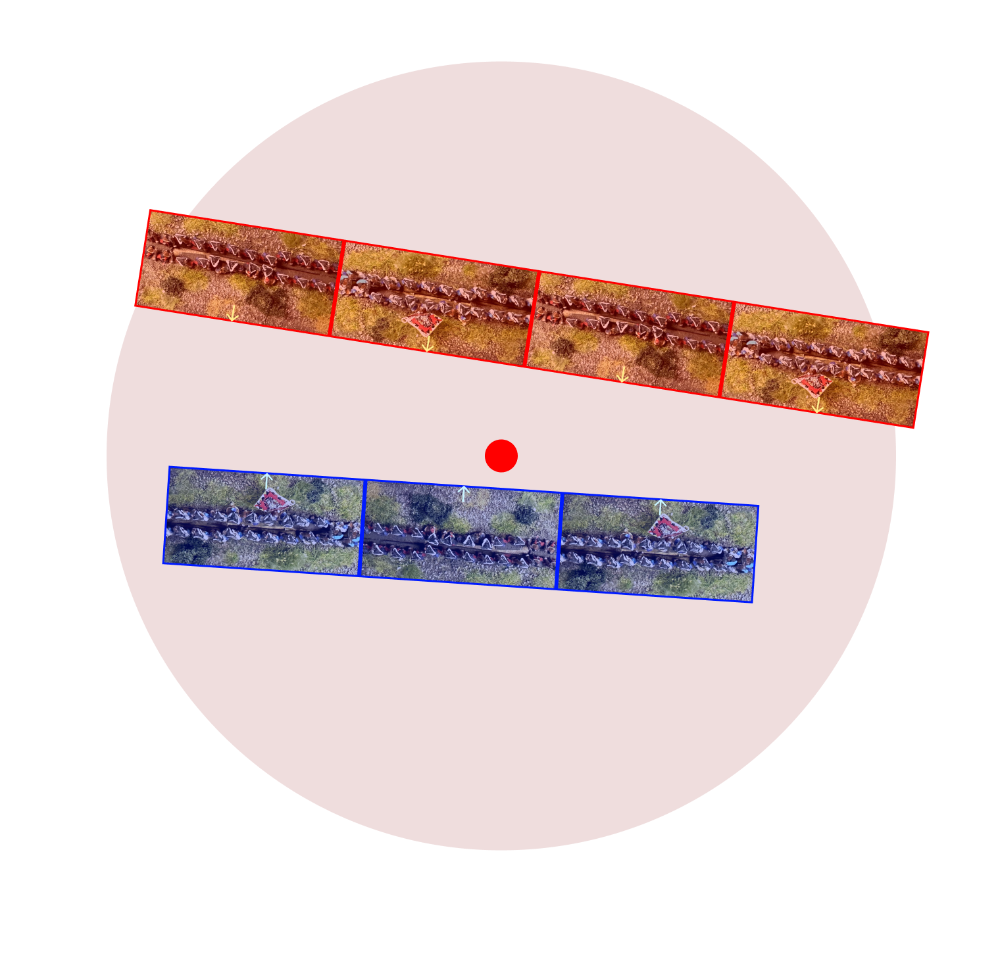
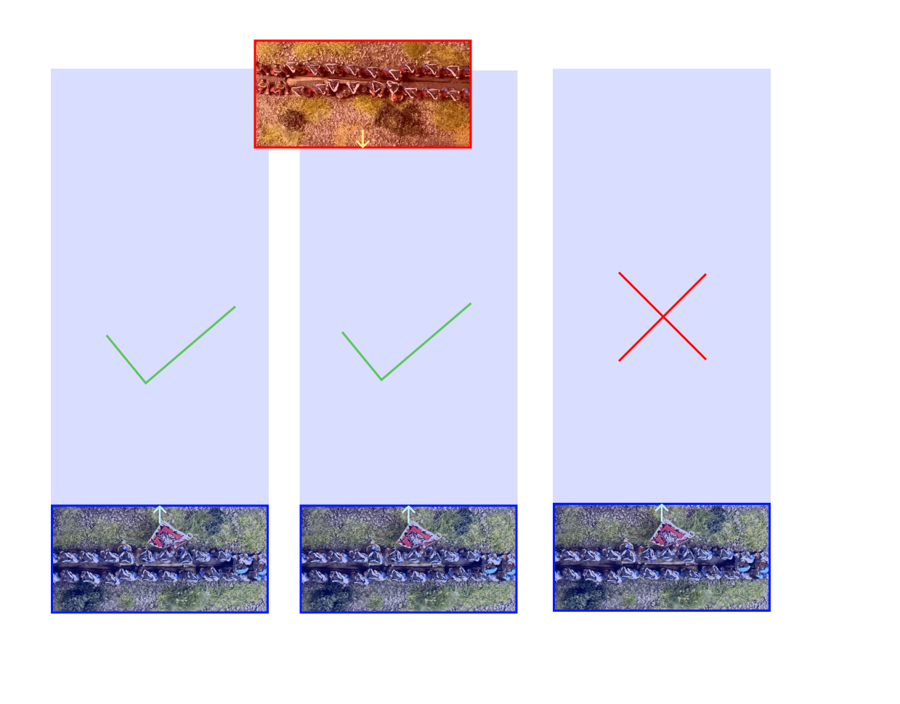
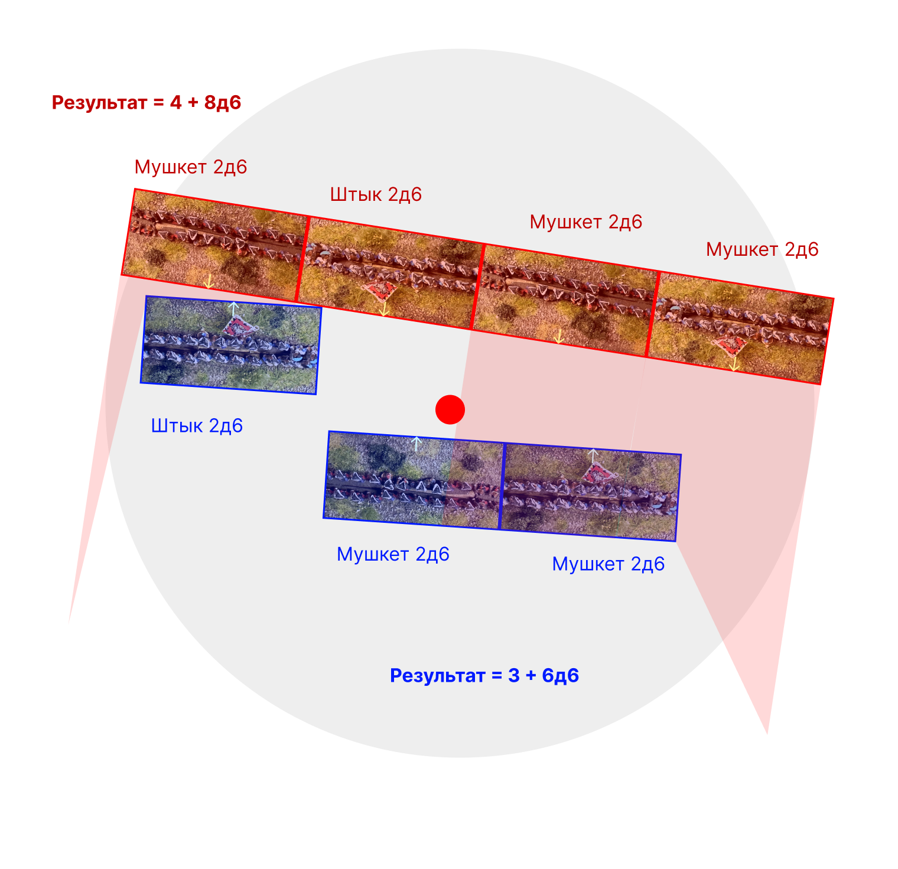
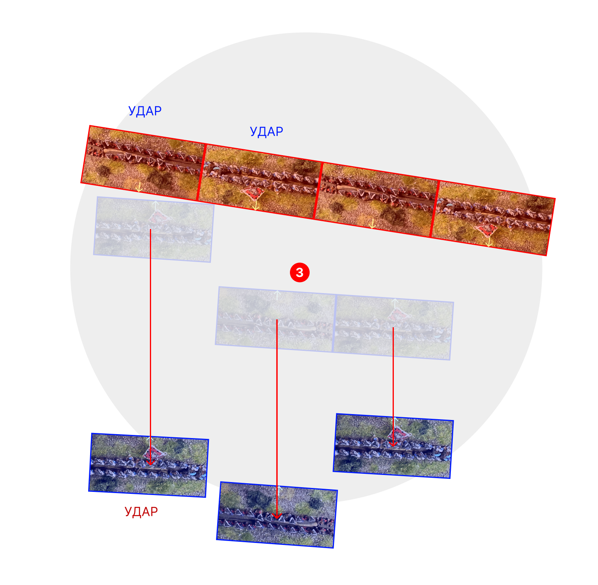
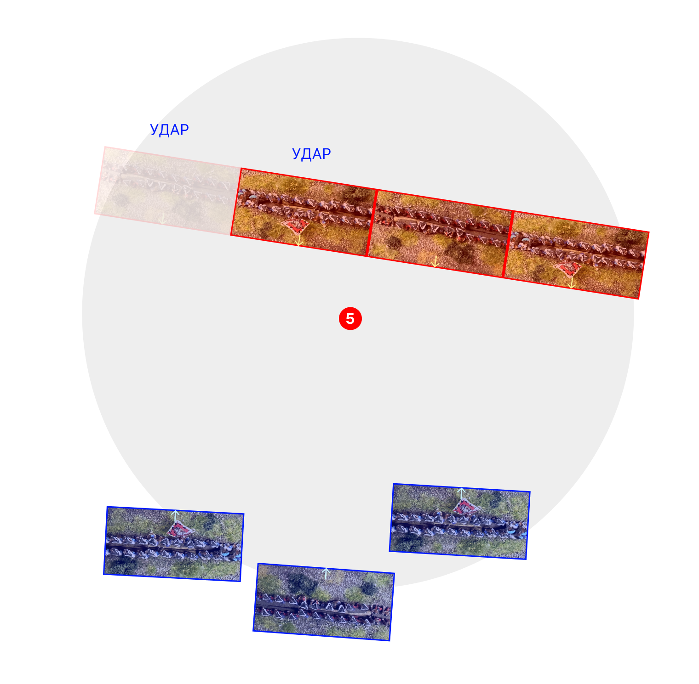

# Облака дыма 
Облака дыма - это варгейм, позволяющий отыгрывать **крупные** сражения эпохи нового времени за вечер буднего дня.

# Обзор
В облаках дыма вы сможете
* Выставить историческую битву по картам и расписаниям, и получить ход событий, похожий на реальный
* Сыграть клубную игру на 1-3 часа с равноценными армиями
* Провести турнир
* Играть армиями на любых (одинаковых) базах
* Выставить любую армию периода, включая экзотические
* Провести нарративный кампейн
<!-- 
## Философские принципы (раздел со сноской)
1) Игроки в варгеймы могут играть: в эпоху, в правила, в армию, в игру. Надо дать интерес всем этим категориям. 
2) Игра в варгеймы это в первую очередь перемещение моделей по столу. Механики, не использующие это, надо минимизировать
3) Игра - это серия информированных решений. 
4) Никто не будет переделывать стол или армию, или даже подставки. Надо дать возможность играть на обычном ваховском или саговском столе миньками на варлордовских или ВРГ базах. Так же, никто не будет подбирать колоду под командиров. Максимальное участие карточек: одна колода на фракцию.
5) Фракции должны отличаться. Нужна какая-то доска тактик, но уже когда будет готова базовая механика. -->

## Историческая справка
Исторический варгейм может подойти к моделированию с двух сторон: снизу вверх, или сверху вниз.
При подходе снизу вверх, мы фокусируемся на деталях и особенностях. Например, мы знаем, что шведы в начале тридцатилетней войны делали сальво, и отражаем это в правилах. 
Как итог, у нас получаются игры с большим количеством типов войск, отражающие эпоху при **чтении правил**

При подходе сверху вниз, мы смотрим картинки с большими стрелками, и читаем общие соображения военачальников. Цитата из википедии про малоизвестное сражение под Лансом:

>Армии выстроились, но так как войска Испании оказались на возвышенности, принц Конде решил не атаковать. Так как французы начали немного отступать, испанская кавалерия завязала бой с тыловыми войсками французской армии и со временем завязался широкомасштабный бой. Испанская пехота отбросила назад французскую, сломала построение 13-го батальона егерей, однако превосходная французская кавалерия сумела провести контрманёвр и прорвала центр испанской армии. 

Если попробовать сделать правила по этому абзацу, получится, что у нас должны быть возможности
* Немного отступать
* Завязать небольшой бой
* Превратить его в широкомасштабный
* Отбросить пехоту назад
* Прорвать центр

При этом, мы постараемся не задумываться о том, как именно были построен 13-й батальон егерей, когда он был сломан. Мы будем считать, что им управляли компетентные офицеры, которые сделали все необходимое в сложившейся тактической ситуации.

Облака дыма это игра второго типа, игрок играет роль главнокомандующего, который принимает глобальные решения, но мало может повлиять на тактические действия конкретных подразделений. 

## Материальная часть и масштаб
Игра использует абстрактный масштаб. Для крупного сражения, например битвы при Бленхейме (100 тысяч участников), можно считать, что база это батальон (400-800 человек) пехоты или два эскадрона (200-400 человек) конницы. Для более ранней эпохи и сражения поменьше, например битвы при Рокруа (50 тысяч участников) или под Лансом (34 тысячи), можно считать, что база это одна или две роты пехоты (100-300) человек, или эскадрон кавалерии (50-150 человек).

Масштаб расстояний так же условный. Базовый ориентир: дистанция ружейного огня равна ширине отряда.

Для дистанций в игре используется базовая ширина или БШ, равная ширине баз ваших отрядов. 
Пример отряда: 

Можно использовать любой масштаб миниатюр. Средняя или малая игра проводится на столе 120х90см. Если ширина ваших баз больше 60мм, или вы отыгрываете огомное сражение, может потребоваться стол побольше.
 
Пример игры: 

В игре используются шестигранные кубики, которые обозначаются d6 иди д6. 

## Победа и поражение
Если в ходе игры *боевой дух* армии игрока падает до нуля, его оппонент тут же одерживает **решительную победу**.
Если игра заканчивается до этого, игрок, у армии которого выше *боевой дух* одерживает **неуверенную победу**. 

Стартовый боевой дух армии равен количеству отрядов, умноженному на два.

## Отряд
| Отряд     | MOVE | RETREAT | DISCIPLINE | STRENGTH | ARMAMENTS                         | SPECIAL |
|-----------|------|---------|------------|----------|-----------------------------------|---------|
| Мушкетеры | 2-1  | 1-2     | 4+         | 1        |  Мушкет (2BW: 2d6); Штык (CC: 2d6)  | -       |
| Кавалерия | 4-2  | 2-4     | 5+         | 1        |  Пистолет (1BW: 1d6); Меч (CC: 2d6) | Погоня  |

Характеристики отряда: 
Движение простое
Движение сложное
Движение вынужденное
Дисциплина
Сила
Вооружения
Спецправила

Маршевое движение показывает, на какое расстояние может подвигаться отряд за один ход. 
Движение сложное показывает, на какое расстояние может подвигаться за один ход отряд в сражении, или при совершении сложного движения.
Сила отряда прибавляется к силе стороны, если отряд находится в сражении.
Дисциплина это значение, которое отряд должен выбросить на d6, чтобы пережить удар.
Вооружения увеличивают силу стороны в сражении в определенных ситуациях: например, если отряд может стрелять или драться в ближнем бою.
Спецправила описаны отдельно, и могут влиять как на силу, так и на скорость отряда в разных ситуациях.

## Армии

*Ориентируемся на армии под Лансом. Французы: 7000 пехоты в 12 батальонах, 9000 в 45 эскадронах, 18 пушек
Испанцы: 9000 пехоты в 16 батальонах, 9000 кавалерии в 54 эскадронах, 38 пушек*

Стандартный формат игры - 300 очков.
Отряды делятся на основные, элитные и вспомогательные.
Основных и вспомогательных отрядов вы можете брать сколько угодно.
Элитных отрядов может быть не больше, чем основных.

Кроме этого, в вашей армии присутствует полководец. Вы можете потратить очки на увеличение умения полководца.
Посредственный полководец достается бесплатно.

| Умение полководца | Кубиков действий | Стоимость |
|-------------------|-----------------------------|-----------|
| Посредственный    | 2                           |0          |
| Компетентный      | 3                           |25         |
| Прославленный     | 4                           |60         |
| Гениальный        | 5                           |100        |

## Понятия
*Отряд*: неделимая подставка с войсками на игровом столе.

*Вынужденное движение*: перемещение войск не в фазу действий. При совершении вынужденного движения, направления задается правилами, дистанцию выбирает оппонент (он же перемещает отряд). После этого, хозяин отряда может повернуть его.

*Сражение*: при контакте войск на поле выставляется маркер сражения. Сражение обозначает именно этот маркер.

*В сражении*: отряд считается в сражении, если находится в радиусе 2БШ от маркера сражения. Иначе: в бою.

*Формация*: несколько отрядов, стоящих в базовом контакте.

*Вооружения*: характеристика отряда, которая определяет, на каком расстоянии и как эффективно он может наносить урон противнику.

*Огневой контакт*: если два отряда стоят так, что хотя бы один из них находится в пределах действия вооружений другого, считается, что эти два отряда находятся в огневом контакте.

*Активный игрок*: игрок, чей сейчас ход

*Пассивный игрок*: любой игрок, не активный в данный момент

# Игровой процесс

Игра разбита на ходы. Игроки делают ходы поочередно. 
Ход игрока проходит следующим образом

1) Действия. В эту фазу, игрок принимает основные решения как полководец и осуществляет их. В остальные фазы идет их отыгрыш по правилам.
2) Начало сражения. В эту фазу, если на поле есть отряды, находящиеся в огневом контакте, которые при этом не находятся в *сражении*, на поле выставляется новый маркер сражения. 
3) Сражение. В эту фазу отыгрываются сражения.

## Действия

Игрок кидает несколько d6, в зависимости от умения своего полководца

| Умение полководца | Количество кубиков действий | 
|-------------------|-----------------------------|
| Посредственный    | 2                           |
| Компетентный      | 3                           |
| Прославленный     | 4                           |
| Гениальный        | 5                           |

Каждый из этих кубиков он может потратить на ОДНО из следующих действий.

1) Простое движение
2) Сложное движение
3) Воодушевление войск
4) Управление сражением
5) Перемещение полководца

За каждую 1, выброшенную на кубиках действий, можно добросить еще один кубик.

В одном сражении можно использовать управление и воодушевление не более чем по 1 разу. Один отряд может переместиться не более одного раза, на марше или в бою. Полководец может перемещаться любое количество раз и использовать любые действия любое количество раз. 

Командный радиус любого полководца равен 2БШ.

### Простое движение
Вы выбираете число *формаций* в командном радусе полководца, равное значению кубика действий. Они могут совершить простое движение.

### Сложное движение
Вы выбираете число *отрядов* в командном радусе полководца, равное значению кубика действий. Они могут совершить сложное движение.

### Воодушевление войск
Вы выбираете *сражение* в командном радиусе полководца. Вы сможете перебрасывать броски дисциплины в этом сражении столько раз, сколько выпало на кубике действия.

### Управление сражением
Вы выбираете *сражение* в командном радиусе полководца. Вы прибавляете к своему результату в сражении в этот ход значение кубика действия.

### Перемещение полководца
Можете переставить полководца в любое место на поле.

## Движение

### Простое и сложное движение
Отряды могут двигаться в любую сторону. 
Простое движение могут делать только отряды, не находящиеся в бою в начале хода.
Когда отряд делает простое движение, в начале движения он поворачивается вокруг центра в любую сторону и далее идет по прямой.

Когда отряд делает сложное движение, в начале движения он поворачивается вокруг центра в любую сторону и далее идет по прямой, и в конце движения может еще раз повернуться вокруг центра.

Отряды могут свободно проходить через союзные отряды, но не могут на них останавливаться.
Нельзя проходить через отряды противника

### Формации

Формацией называется несколько отрядов, находящихся друг с другом в контакте.

Углового контакта не достаточно, чтобы образовать формацию.

## Начало сражения

После фазы действий идет фаза начала сражения.
Если на поле есть отряды, которые находятся в огневом контакте с противником, нужно выставить на поле маркер сражения. 

Активный игрок должен выставить маркер так, чтобы в радиус сражения (2BW) вошло как можно больше отрядов с обеих сторон, находящихся в огневом контакте, но не в сражении.

Если в радиусе сражения уже были отряды, находящиеся в сражении, новый маркер становится частью этого сражения. Это значит, отряды вокруг нового маркера так же начинают в нем участвовать.

У каждого маркера сражения есть *цена*. Когда маркер ставится на поле, его цена равна 0.

### Огневой контакт и линия огня.

При наличии дистанционных вооружений, отряд имеет линию огня. Она идет строго вперед перед отрядом на максимальную дистанцию вооружения.

Линия огня не проходит через другие отряды, союзные или вражеские. Если линия огня становится уже 0.5 BW, она прерывается.

Два отряда противников находятся в огневом контакте, если хотя бы один из них находится на линии огня другого.

Отряды противников в базовом контакте всегда находятся в огневом контакте.

## Сражение

## Результат
Результат сражения это число, которое определяется так.

Вначале, отряды, участвующие в сражении, добавляют свою силу к результату.
Затем, отряды, имеющие на линии огня противника, добавляют силу своих вооружений к результату.
Затем, прибавляются все остальные бонусы, например, управление сражением от командира.

Отряд обязан использовать вооружение с минимальной дистанцией. Например, если отряд кавалерии находится в контакте с противником, он обязан использовать меч и не может использовать пистолет.

## Удары

За каждые 10 очков результата, сторона наносит удар одному отряду противника. За каждые 10 очков, на которые результат стороны превосходит результат противника, она наносит еще один удар отряду противника.

Удары наносятся вначале ближайшим отрядам противника. Если несколько таких отрядов находятся одинаково далеко (например, в контакте), вы выбираете, кому из них наносить удар.

Второй удар оряду противника вы можете нанести только после того, как все его отряды в этом сражении уже получили хотя бы один удар. Порядок ударов на втором круге определяется так же, как на первом: вначале те, кто ближе.

## Разрешение ударов

Первым удары по своим отрядам разрешает *активный* игрок.

Сперва, каждый ваш отряд может отменить один удар по себе, *отступив*. При отступлении отряд совершает **вынужденное перемещение** по прямой к своей стороне стола. Противник выбирает дистанцию, на которую отступит ваш отряд, и передвигает его. После этого вы можете повернуть свой отряд вокруг центра в любую сторону.

Например, дистанция отступления мушкетеров 1-2. Значит, противник передвигает ваши отряды на расстояние от 1BW до 2BW, после чего вы их разворачиваете.

Решение, будет отряд отступать или примет удар, принимает его хозяин. Решение принимается за каждый отряд по-отдельности.

За каждый отступивший отряд, цена маркера сражения вырастает на 1.

Затем, все отряды, на которых остались удары (например, они решили не отступать, или были лишние удары) должны пройти тест на дисциплину за каждый удар. Отряды, не прошедшие этот тест, уничтожены. Они убираются со стола, а армия игрока теряет 2 боевого духа.

После этого, такую же процедуру проходит пассивный игрок.
В нашем примере, он выбирает никем не отступать, а проходить два теста на дисциплину. Один отряд погибает.

## Конец сражения

Если после разрешения ударов, в радиусе маркера сражения остались только отряды одной стороны, она побеждает. Армия ее противников теряет столько боевого духа, какая была цена сражения на момент его окончания. После этого маркер (или несколько) удаляется с поля.

Если боевой дух армии падает до нуля, она терпит поражение.

После того, как были отыграны все сражения, начинается новый ход.

# Спецправила

## Погоня
Отряды в контакте с этим отрядом, максимальное отступление которых меньше или равно его боевому движению, уничтожаются. После этого, отряд с погоней делает **вынужденное движение** в сторону края стола противника.